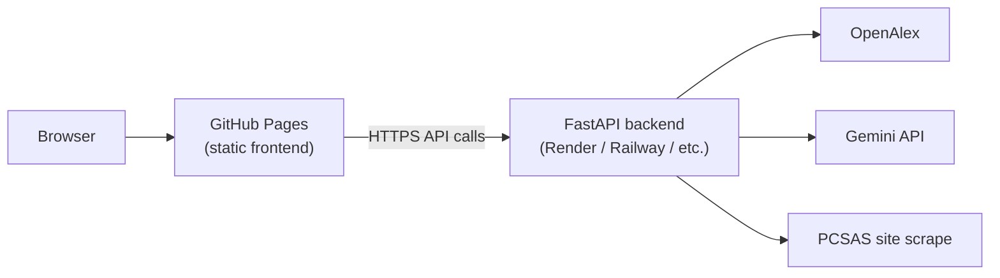

# GitHub Pages Deployment Plan

Draft steps to publish the **re-search frontend** as a public webpage on GitHub Pages.

## Important constraint

GitHub Pages hosts **static files only** (HTML, CSS, JS). It cannot run the FastAPI backend.

| Component | GitHub Pages | Separate host required |
|-----------|--------------|----------------------|
| Frontend (`frontend/`) | Yes | — |
| Backend (`backend/`) | No | Yes (Render, Railway, Fly.io, etc.) |
| Secrets (`GEMINI_API_KEY`) | Never in frontend | Backend env vars only |

The live site will call a deployed API URL (not `localhost:8000`).

---

## Target architecture



---

## Phase 1 — Prep the frontend for production

### 1.1 Add a configurable API base URL

Today all requests use relative paths like `/api/v1/...`, which only work with the webpack dev proxy.

**Change:** introduce a single base URL used by every `fetch` call.

Example (`frontend/src/config.ts`):

```ts
export const API_BASE_URL =
  (window as any).__API_BASE_URL__ ||
  process.env.API_BASE_URL ||
  '/api/v1';
```

Then update [`frontend/src/api.ts`](frontend/src/api.ts) and other files that call `fetch('/api/v1/...')` to use `${API_BASE_URL}/...`.

For local dev, keep default `/api/v1` so webpack proxy still works.

### 1.2 Set webpack `publicPath` for GitHub Pages

If the repo is `username/re-search`, the site URL is:

`https://username.github.io/re-search/`

Webpack must emit asset paths with that prefix.

In [`frontend/webpack.config.js`](frontend/webpack.config.js):

```js
output: {
  filename: 'bundle.js',
  path: path.resolve(__dirname, 'dist'),
  publicPath: process.env.PUBLIC_PATH || '/',
},
mode: process.env.NODE_ENV === 'production' ? 'production' : 'development',
```

Set `PUBLIC_PATH=/re-search/` in CI when building for a project site (not a user/org root site).

### 1.3 Fix production build output

Current build writes to `frontend/public/` in development mode. For deployment:

- Output to `frontend/dist/` (clean deploy artifact)
- Use production mode for minification
- Resolve CSS: `index.html` links `./style.css`, but CSS is injected via `style-loader` into JS today — either remove the dead `<link>` or add `mini-css-extract-plugin` and emit `style.css`

Suggested `package.json` script:

```json
"build": "NODE_ENV=production webpack"
```

### 1.4 Add SPA fallback (optional but recommended)

GitHub Pages does not route unknown paths to `index.html` by default. This app is mostly a single-page shell, so serving `index.html` at the site root is usually enough. If you add client-side routes later, add a `404.html` copy of `index.html` for GitHub Pages SPA behavior.

---

## Phase 2 — Prep the backend for public access

### 2.1 Enable CORS

Add CORS middleware in [`backend/app/main.py`](backend/app/main.py) allowing your GitHub Pages origin:

```python
from fastapi.middleware.cors import CORSMiddleware

app.add_middleware(
    CORSMiddleware,
    allow_origins=[
        "https://<username>.github.io",
        "http://localhost:9000",
    ],
    allow_credentials=True,
    allow_methods=["*"],
    allow_headers=["*"],
)
```

Replace with your exact Pages URL (including repo path if applicable).

### 2.2 Deploy backend to a host

Pick one provider (all have free tiers suitable for demos):

| Provider | Notes |
|----------|--------|
| [Render](https://render.com) | Simple FastAPI deploy from GitHub |
| [Railway](https://railway.app) | Easy env var + Docker |
| [Fly.io](https://fly.io) | Good if you want a Dockerfile |

**Deploy command (example):**

```bash
uvicorn app.main:app --host 0.0.0.0 --port $PORT
```

**Required environment variables:**

- `GEMINI_API_KEY` — for draft/AI features
- Optional: cache paths, log level

**Note:** Backend needs outbound network for OpenAlex, PCSAS scraping, PDF download, etc.

### 2.3 Confirm API health

After deploy, verify:

```bash
curl https://<your-backend-host>/api/v1/programs/stats
curl https://<your-backend-host>/api/v1/pcsas
```

Make sure port `8000` on your Mac is not confused with another Docker app — use the **deployed** backend URL in the frontend config.

---

## Phase 3 — GitHub Actions workflow

Create [`.github/workflows/deploy-pages.yml`](.github/workflows/deploy-pages.yml):

```yaml
name: Deploy to GitHub Pages

on:
  push:
    branches: [main]
  workflow_dispatch:

permissions:
  contents: read
  pages: write
  id-token: write

concurrency:
  group: pages
  cancel-in-progress: true

jobs:
  build:
    runs-on: ubuntu-latest
    steps:
      - uses: actions/checkout@v4

      - uses: actions/setup-node@v4
        with:
          node-version: 20
          cache: npm
          cache-dependency-path: frontend/package-lock.json

      - name: Install and build frontend
        working-directory: frontend
        env:
          NODE_ENV: production
          PUBLIC_PATH: /re-search/          # omit or set / for user site
          API_BASE_URL: https://YOUR-BACKEND.example.com/api/v1
        run: |
          npm ci
          npm run build

      - uses: actions/upload-pages-artifact@v3
        with:
          path: frontend/dist

  deploy:
    needs: build
    runs-on: ubuntu-latest
    environment:
      name: github-pages
      url: ${{ steps.deployment.outputs.page_url }}
    steps:
      - id: deployment
        uses: actions/deploy-pages@v4
```

Replace:

- `PUBLIC_PATH` — `/re-search/` for project pages, `/` for `username.github.io` root repo
- `API_BASE_URL` — your deployed FastAPI URL

---

## Phase 4 — Enable GitHub Pages in repo settings

1. Push the workflow to `main`.
2. GitHub → **Settings → Pages**
3. **Source:** GitHub Actions (not “Deploy from branch” once using Actions artifact flow)
4. Wait for the workflow to complete.
5. Open `https://<username>.github.io/re-search/` (or root URL).

---

## Phase 5 — Wire frontend to backend at runtime (pick one)

### Option A — Build-time injection (simplest)

Set `API_BASE_URL` in the GitHub Actions workflow env (shown above). Rebuild/redeploy when the backend URL changes.

### Option B — Runtime injection (more flexible)

In `index.html`, before `bundle.js`:

```html
<script>
  window.__API_BASE_URL__ = 'https://YOUR-BACKEND.example.com/api/v1';
</script>
```

Generate this from a small templating step in CI, or maintain a `config.js` in the repo for staging vs. production.

---

## Phase 6 — Verification checklist

After deploy, test in the browser (not just curl):

- [ ] Landing page loads; no 404 on `bundle.js`
- [ ] Network tab shows API calls going to the **deployed backend**, not `localhost`
- [ ] Program Discovery loads ranked programs
- [ ] Program stats / refresh works
- [ ] Profile create/save works
- [ ] Draft generation works (requires valid `GEMINI_API_KEY` on backend)
- [ ] No CORS errors in console
- [ ] PCSAS scrape endpoint returns data

---

## Phase 7 — Recommended follow-ups

### Custom domain (optional)

1. Add `CNAME` in GitHub Pages settings.
2. Update CORS `allow_origins` on the backend.
3. Enable HTTPS (GitHub handles cert).

### Staging environment

- `main` → production Pages
- `develop` → preview backend + optional preview Pages (GitHub Environments)

### Security hardening before public launch

- Rate-limit public API routes
- Do not expose admin-only routes (`POST /programs/refresh`) without auth
- Store `GEMINI_API_KEY` only on backend host
- Add basic error monitoring (Sentry, etc.)

### Reduce backend dependency (future)

For a **demo-only** static deploy, you could ship precomputed `accredited_programs.json` and read it client-side — but PI search, drafts, and profile analysis still need the backend.

---

## Minimal implementation order

1. **CORS** on FastAPI + deploy backend → get a public API URL
2. **`API_BASE_URL`** in frontend + replace hardcoded `/api/v1` paths
3. **Production webpack build** → `frontend/dist` with correct `publicPath`
4. **GitHub Actions** workflow → Pages deploy
5. **Enable Pages** in repo settings → smoke test

Estimated effort: **half day** for a working demo, **1–2 days** with polish (CORS, env separation, staging, custom domain).

---

## Related docs

- [FUTURE_STEPS.md](FUTURE_STEPS.md) — product roadmap after core functionality is stable
- [README.md](README.md) — local development setup
